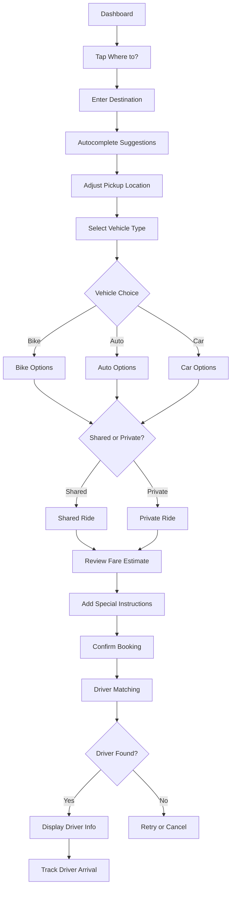
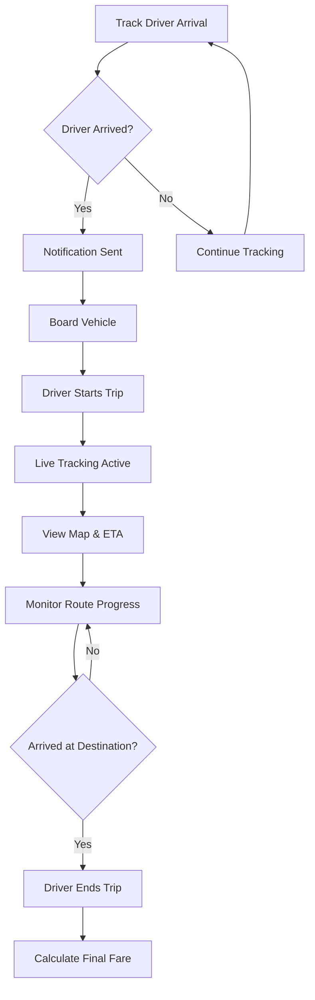
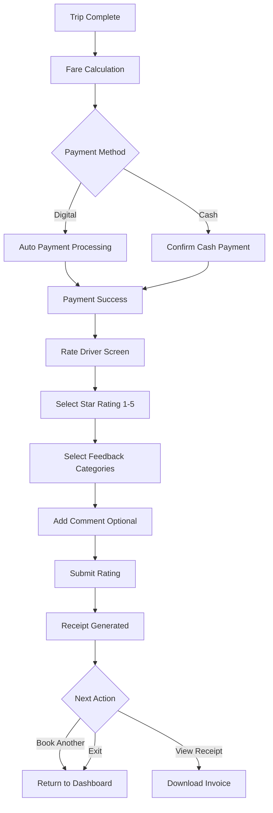
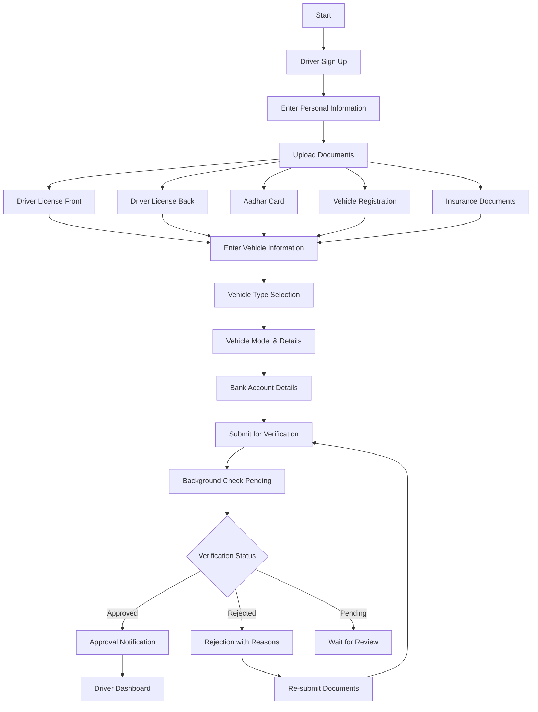
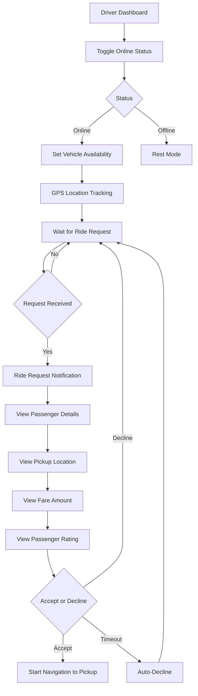
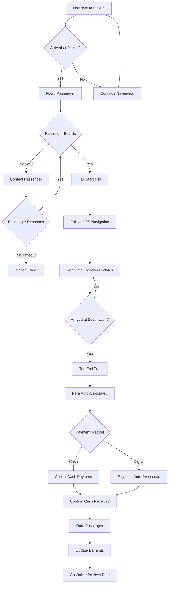
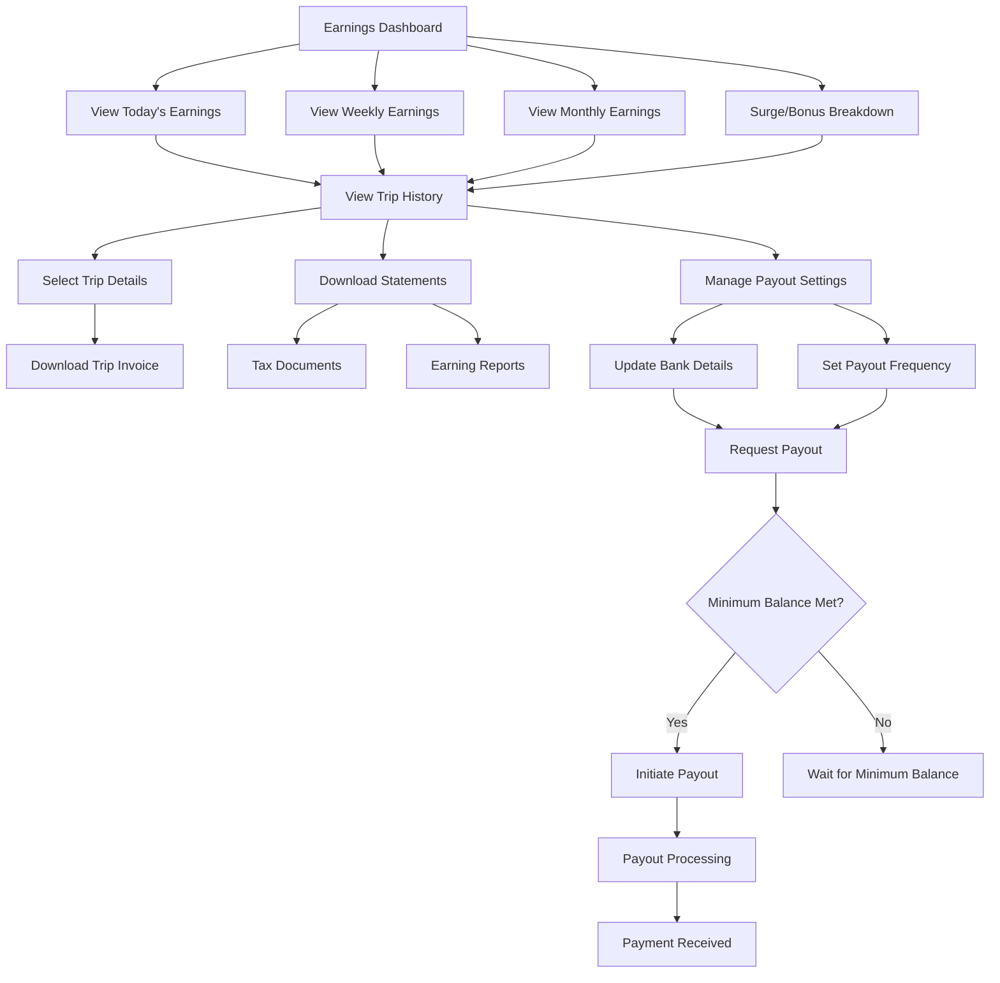
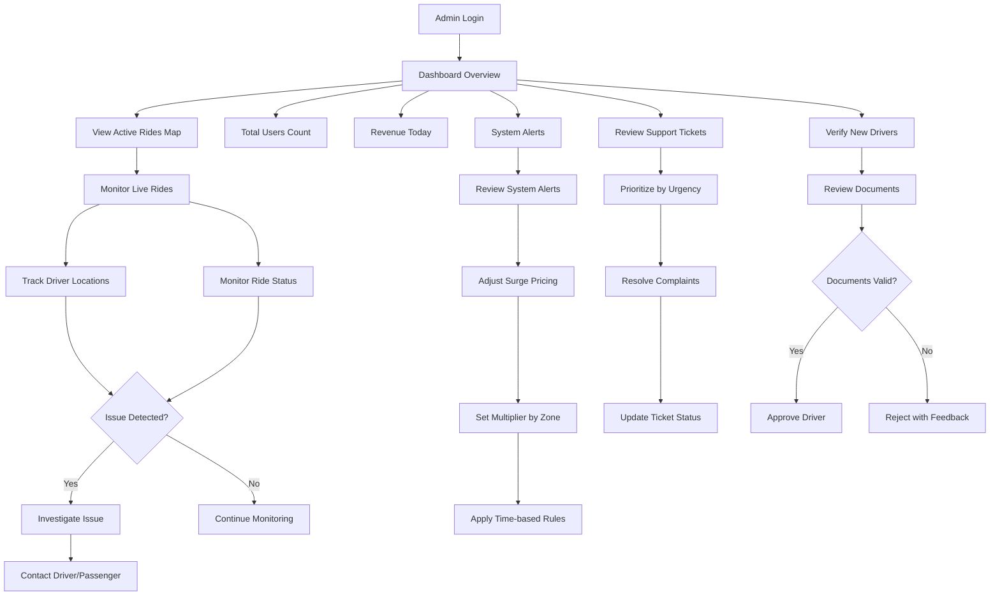
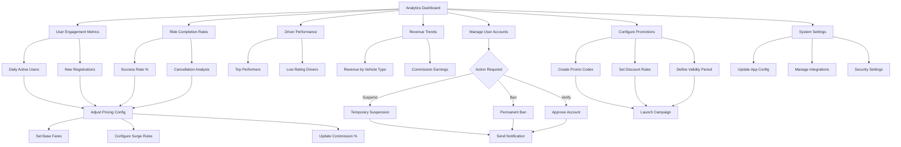

# VahanGo - Multi-Vehicle Ride-Hailing Platform

## Project Overview

**VahanGo** is a comprehensive multi-vehicle ride-hailing Progressive Web App (PWA) that connects passengers with drivers across three vehicle categories: bikes, autos, and cars. The platform offers real-time ride booking, dynamic fare calculation, live tracking, and flexible ride-sharing options to provide affordable and convenient transportation solutions.


---

## Database Schema
```python
continue
```
### Entity Relationship Diagram

```mermaid
erDiagram
    USERS {
        uuid id PK
        varchar mail UNIQUE
        varchar name
        varchar phone UNIQUE
        varchar password_hash
        varchar role
        varchar avatar_url
        timestamp verified_at
        timestamp created_at
        timestamp updated_at
    }

    DRIVERS {
        uuid id PK
        uuid user_id FK
        boolean is_verified
        boolean is_active
        int total_rides
        float rating
        uuid active_vehicle_id FK
    }

    RIDERS {
        uuid id PK
        uuid user_id FK
    }

    DRIVER_LOCATION {
        uuid id PK
        uuid driver_id FK
        float latitude
        float longitude
        timestamp updated_at
    }

    RIDER_LOCATION {
        uuid id PK
        uuid rider_id FK
        float latitude
        float longitude
        timestamp updated_at
    }

    VEHICLES {
        uuid id PK
        uuid driver_id FK
        varchar type
        varchar model
        varchar reg_num UNIQUE
        int capacity
        varchar color
        int year
        boolean status_active
    }

    RIDE_REQUESTS {
        uuid id PK
        uuid rider_id FK
        float src_lat
        float src_lng
        float dest_lat
        float dest_lng
        boolean is_shared
        float surge_mult
        varchar status
        timestamp requested_at
        timestamp cancelled_at
    }

    RIDES {
        uuid id PK
        uuid ride_request_id FK
        uuid driver_id FK
        uuid rider_id FK
        uuid vehicle_id FK
        float amount
        varchar status
        float surge_mult
        timestamp started_at
        timestamp completed_at
        timestamp cancelled_at
    }

    WALLET {
        uuid id PK
        uuid user_id FK
        float balance
        timestamp updated_at
    }

    TRANSACTIONS {
        uuid id PK
        uuid user_id FK
        uuid ride_id FK
        float amount
        varchar transaction_type
        varchar payment_method
        varchar status
        timestamp created_at
        timestamp updated_at
    }

    RATINGS {
        uuid id PK
        uuid ride_id FK
        uuid rater_id FK
        uuid ratee_id FK
        float rating
        varchar comments
        timestamp created_at
    }

    %% Relationships
    USERS ||--o{ DRIVERS : "has"
    USERS ||--o{ RIDERS : "has"
    USERS ||--o{ WALLET : "owns"
    USERS ||--o{ TRANSACTIONS : "makes"
    DRIVERS ||--o{ VEHICLES : "owns"
    DRIVERS ||--o{ DRIVER_LOCATION : "updates"
    RIDERS ||--o{ RIDER_LOCATION : "updates"
    RIDERS ||--o{ RIDE_REQUESTS : "creates"
    RIDE_REQUESTS ||--|| RIDES : "fulfilled_as"
    VEHICLES ||--o{ RIDES : "used_in"
    DRIVERS ||--o{ RIDES : "drives"
    RIDERS ||--o{ RIDES : "books"
    RIDES ||--o{ TRANSACTIONS : "generates"
    RIDES ||--o{ RATINGS : "receives"
    RATINGS }o--|| USERS : "rater"
    RATINGS }o--|| USERS : "ratee"
```
## UserFlow



#### 3. During the Ride



#### 4. Post-Ride



### Driver Journey

#### 1. Registration & Verification



#### 2. Going Online & Receiving Rides


#### 3. Completing Rides



#### 4. Managing Earnings



### Admin Operations Flow

#### 1. Daily Operations



#### 2. System Management



---

## Features Overview

### Passenger Features
- ✅ Multi-authentication (Email, Phone OTP, Google)
- ✅ Profile management
- ✅ Interactive map-based booking
- ✅ Multi-vehicle selection (Bike, Auto, Car)
- ✅ Real-time fare estimation
- 🚧 Live ride tracking (UI ready, backend in progress)
- 🚧 Payment integration (Razorpay - planned)
- 🚧 Trip history with receipts
- 🚧 Rating & feedback system (UI ready)
- ✅ Ride sharing options

### Driver Features
- 🚧 Driver registration & KYC
- 🚧 Vehicle management
- 🚧 Ride request handling
- 🚧 Navigation & route optimization
- 🚧 Earnings dashboard (UI ready)
- 🚧 Performance metrics
- 🚧 Real-time location sharing

### Admin Features
- 🚧 User & driver management
- ✅ Dynamic pricing configuration
- 🚧 Real-time operations monitoring
- 🚧 Analytics dashboard (UI ready)
- 🚧 Customer support tools

### System Features
- ✅ Real-time driver matching algorithm
- ✅ Dynamic surge pricing
- 🚧 Push notifications (FCM - planned)
- 🚧 Offline capability (PWA)
- ✅ Location-based services

**Legend:** ✅ Implemented | 🚧 In Progress | ❌ Not Started

---

## Design System

### Color Palette

```css
/* Light Mode */
--primary: 221 83% 53%;        /* #2563EB Professional Blue */
--secondary: 142 71% 45%;      /* #10B981 Success Green */
--accent: 38 92% 50%;          /* #F59E0B Warning Orange */
--background: 210 40% 98%;     /* #F8FAFC Light Gray */
--foreground: 222 47% 11%;     /* #1F2937 Dark Gray */

/* Dark Mode */
--primary: 221 83% 53%;
--secondary: 142 71% 45%;
--accent: 38 92% 50%;
--background: 222 47% 11%;
--foreground: 210 40% 98%;
```

### Typography
- **Font Family:** Inter (Google Fonts)
- **Headings:** Bold (700), Semi-bold (600)
- **Body:** Regular (400), Medium (500)

### Design Principles
- Mobile-first responsive design
- Touch-friendly (min 44px touch targets)
- High contrast for outdoor visibility
- Material Design iconography (lucide-react)
- Consistent spacing (Tailwind scale)

---

## Security Features

### Row Level Security (RLS)
All tables implement RLS policies to ensure:
- Users only access their own data
- Drivers view assigned rides only
- Passengers view active/online drivers only
- Proper role-based access control

### Authentication
- JWT token-based authentication
- Secure password hashing (Supabase Auth)
- OAuth integration (Google)
- Phone OTP verification
- Session persistence with auto-refresh

### API Security
- CORS headers configured
- Service role key for edge functions
- Input validation with Zod schemas
- SQL injection prevention (parameterized queries)
- Rate limiting (Supabase built-in)

---

## Development Setup

### Prerequisites
- Node.js 18+ (recommend using nvm)
- npm or yarn
- Supabase account
- Google Maps API key

### Installation

```bash
# Clone the repository
git clone <YOUR_GIT_URL>
cd vahango

# Install dependencies
npm install

# Set up environment variables
cp .env.example .env
# Add your Supabase credentials and Google Maps API key

# Start development server
npm run dev
```

### Environment Variables

```env
VITE_SUPABASE_URL=https://dzqytytnntyblnxpkrks.supabase.co
VITE_SUPABASE_ANON_KEY=your_anon_key_here
VITE_GOOGLE_MAPS_API_KEY=your_google_maps_key_here
```

---

## Deployment

### Frontend Deployment
The app is automatically deployed via Lovable:
1. Click "Publish" in Lovable dashboard
2. App is deployed to: `https://vahango.lovable.app`
3. Custom domain can be connected in Project Settings

### Edge Functions
Edge functions are automatically deployed when code is pushed to the repository. View logs in Supabase Dashboard → Functions.

---

## Project Roadmap

### Phase 1: Foundation ✅
- [x] Project setup
- [x] Authentication system
- [x] Database schema
- [x] Basic UI components

### Phase 2: Core Features (Current)
- [x] Ride booking flow
- [x] Fare calculation
- [x] Driver matching
- [ ] Real-time tracking
- [ ] Payment integration

### Phase 3: Advanced Features
- [ ] Push notifications
- [ ] Driver app completion
- [ ] Admin panel completion
- [ ] Analytics dashboard

### Phase 4: Optimization
- [ ] Performance optimization
- [ ] Offline support
- [ ] Load testing
- [ ] Security audit

### Phase 5: Launch
- [ ] Beta testing
- [ ] Bug fixes
- [ ] Production deployment
- [ ] Marketing

---

## Contributing

This is a Lovable project. You can contribute by:
1. Opening the project in Lovable
2. Making changes via AI prompts
3. Changes auto-sync to GitHub
4. Or clone and push changes manually

---

## Support

- **Documentation:** [Lovable Docs](https://docs.lovable.dev)
- **Community:** [Lovable Discord](https://discord.com/channels/1119885301872070706/1280461670979993613)
- **Project URL:** https://lovable.dev/projects/2744765c-6df2-4f4f-9ba5-6a3ade289d15

---

## License

All rights reserved. This project is for portfolio/demonstration purposes.
