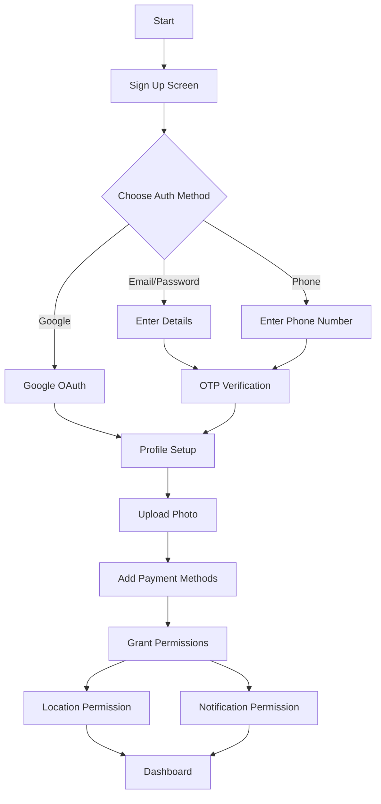
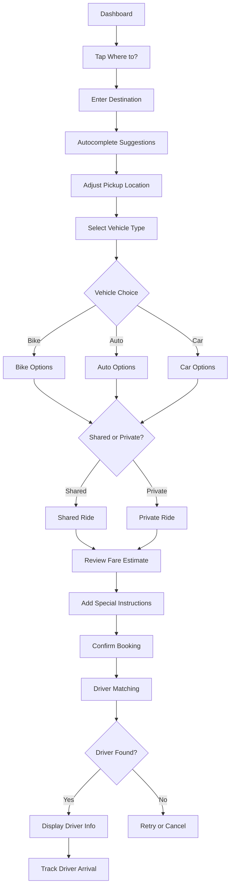
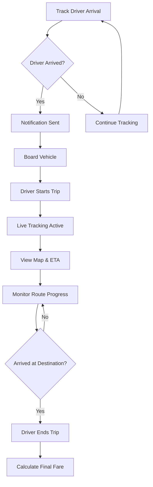
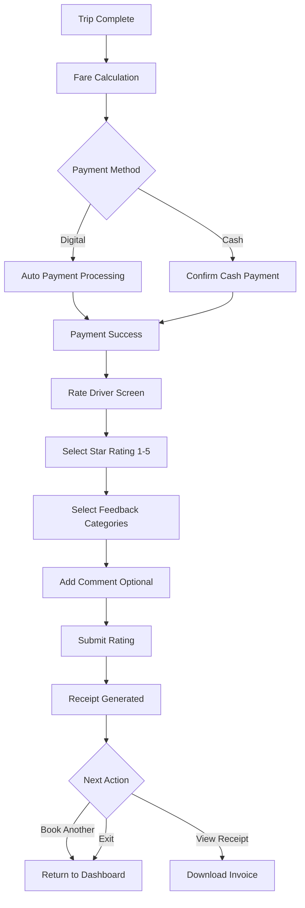
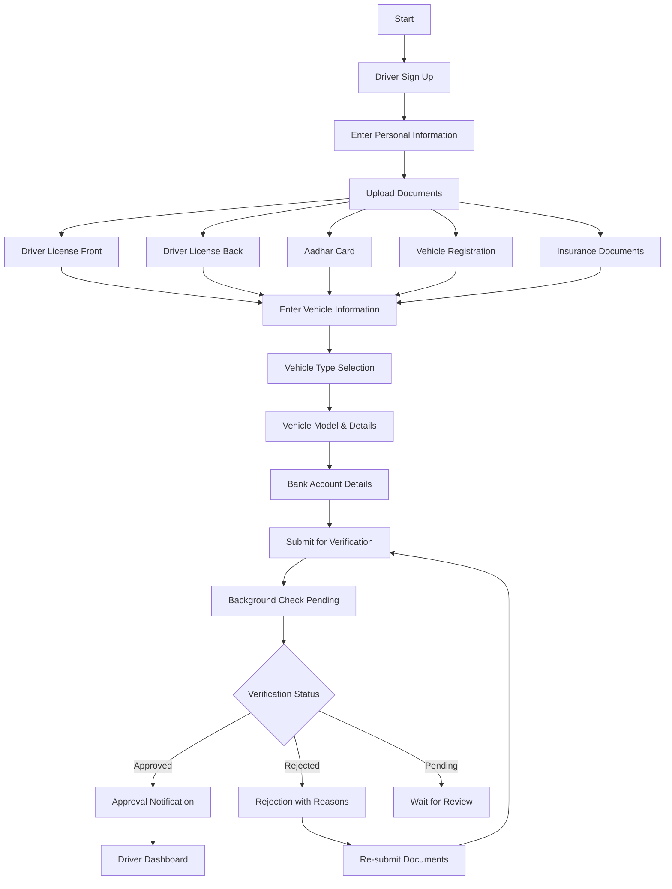
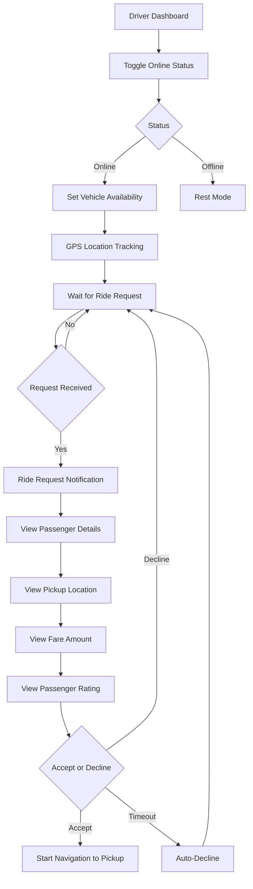
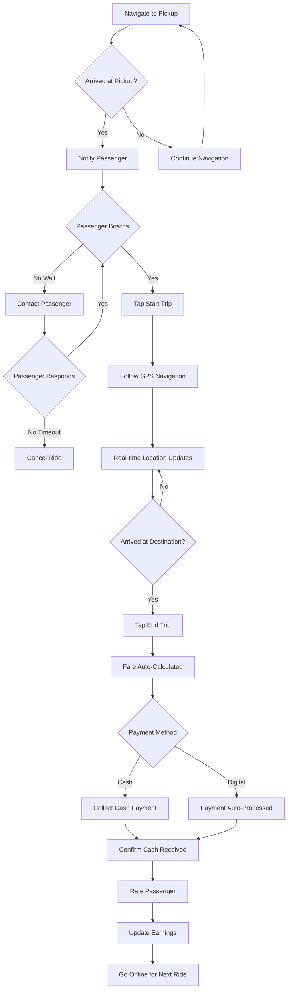
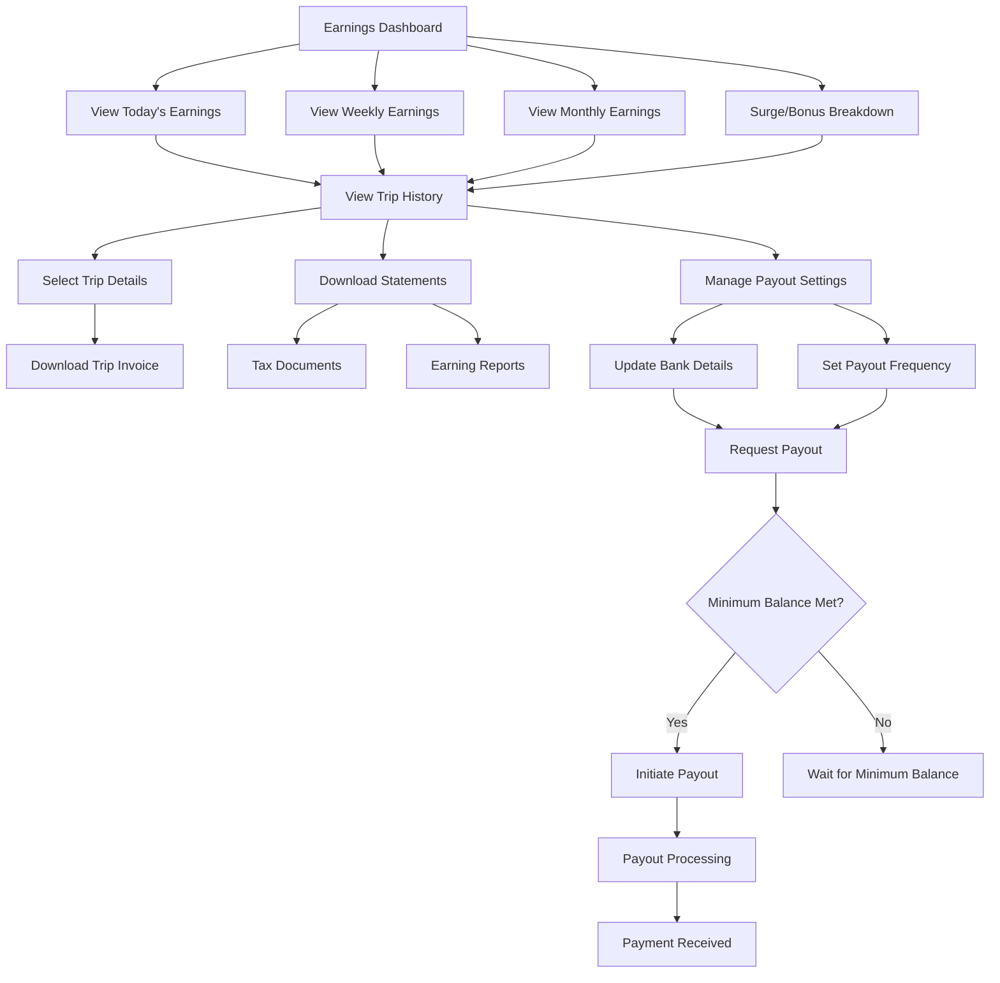
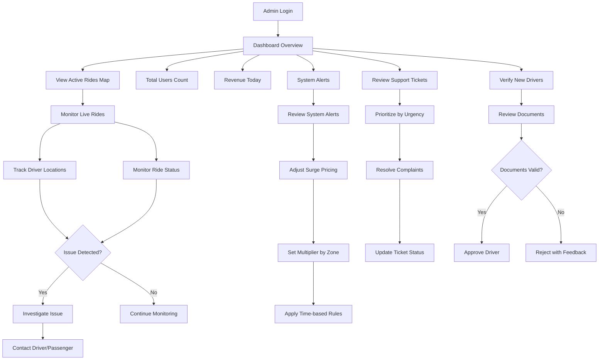
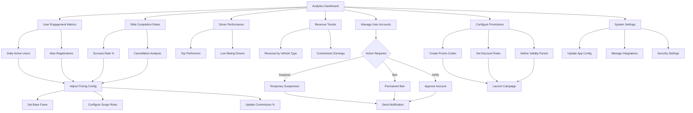

# VahanGo - Multi-Vehicle Ride-Hailing Platform

## Project Overview

**VahanGo** is a comprehensive multi-vehicle ride-hailing Progressive Web App (PWA) that connects passengers with drivers across three vehicle categories: bikes, autos, and cars. The platform offers real-time ride booking, dynamic fare calculation, live tracking, and flexible ride-sharing options to provide affordable and convenient transportation solutions.


---

## System Architecture

### Architecture Overview

```
┌─────────────────────────────────────────────────────────────┐
│                     Client Layer (PWA)                       │
│  ┌──────────────┐  ┌──────────────┐  ┌──────────────┐      │
│  │  Passenger   │  │    Driver    │  │    Admin     │      │
│  │     App      │  │     App      │  │    Panel     │      │
│  └──────────────┘  └──────────────┘  └──────────────┘      │
└─────────────────────────────────────────────────────────────┘
                            │
                            ▼
┌─────────────────────────────────────────────────────────────┐
│                    API Gateway Layer                         │
│              Supabase Client (REST + Realtime)              │
└─────────────────────────────────────────────────────────────┘
                            │
                            ▼
┌─────────────────────────────────────────────────────────────┐
│                   Backend Services Layer                     │
│  ┌──────────────────────────────────────────────────────┐  │
│  │            Supabase Edge Functions                    │  │
│  │  • calculate-fare    • match-driver                   │  │
│  └──────────────────────────────────────────────────────┘  │
│  ┌──────────────────────────────────────────────────────┐  │
│  │              Supabase Auth Service                    │  │
│  │  • Email/Password  • Phone (OTP)  • Google OAuth     │  │
│  └──────────────────────────────────────────────────────┘  │
│  ┌──────────────────────────────────────────────────────┐  │
│  │             Supabase Realtime Engine                  │  │
│  │  • Live location tracking  • Ride status updates     │  │
│  └──────────────────────────────────────────────────────┘  │
└─────────────────────────────────────────────────────────────┘
                            │
                            ▼
┌─────────────────────────────────────────────────────────────┐
│                     Data Layer                               │
│              PostgreSQL with Row Level Security              │
│  • Users & Profiles  • Drivers  • Vehicles  • Rides         │
│  • Transactions  • Ratings  • Pricing Config                │
└─────────────────────────────────────────────────────────────┘
```

---

## Database Schema

### Entity Relationship Diagram

```
┌──────────────┐         ┌──────────────┐         ┌──────────────┐
│   profiles   │         │  user_roles  │         │   drivers    │
├──────────────┤         ├──────────────┤         ├──────────────┤
│ id (PK)      │────┐    │ id (PK)      │    ┌────│ id (PK)      │
│ full_name    │    │    │ user_id (FK) │    │    │ user_id (FK) │
│ phone        │    │    │ role (enum)  │    │    │ license_no   │
│ email        │    │    └──────────────┘    │    │ rating       │
│ avatar_url   │    │                        │    │ total_rides  │
└──────────────┘    │                        │    │ is_online    │
                    │                        │    │ current_lat  │
                    └────────────────────────┘    │ current_lon  │
                                                  │ status       │
                                                  └──────────────┘
                                                         │
                                                         │
                    ┌────────────────────────────────────┘
                    │
                    ▼
           ┌──────────────┐
           │   vehicles   │
           ├──────────────┤
           │ id (PK)      │
           │ driver_id(FK)│───┐
           │ vehicle_type │   │
           │ model        │   │
           │ capacity     │   │
           │ reg_number   │   │
           │ is_shared    │   │
           └──────────────┘   │
                              │
        ┌─────────────────────┴─────────────────────┐
        │                                           │
        ▼                                           ▼
┌──────────────┐                            ┌──────────────┐
│    rides     │                            │   ratings    │
├──────────────┤                            ├──────────────┤
│ id (PK)      │                            │ id (PK)      │
│ passenger_id │                            │ ride_id (FK) │
│ driver_id(FK)│────────────────────────────│ rated_by(FK) │
│ vehicle_id   │                            │ rated_user   │
│ pickup_lat   │                            │ rating       │
│ pickup_lon   │                            │ comment      │
│ dropoff_lat  │                            │ categories   │
│ dropoff_lon  │                            └──────────────┘
│ vehicle_type │
│ status       │                     ┌──────────────────┐
│ final_fare   │                     │  ride_locations  │
│ surge_mult   │                     ├──────────────────┤
└──────────────┘                     │ id (PK)          │
        │                            │ ride_id (FK)     │
        │                            │ latitude         │
        └────────────────────────────│ longitude        │
                                     │ recorded_at      │
        ┌────────────────────────────└──────────────────┘
        │
        ▼
┌──────────────┐              ┌──────────────────┐
│ transactions │              │  pricing_config  │
├──────────────┤              ├──────────────────┤
│ id (PK)      │              │ id (PK)          │
│ ride_id (FK) │              │ vehicle_type     │
│ user_id (FK) │              │ base_fare        │
│ amount       │              │ per_km_rate      │
│ payment_meth │              │ per_minute_rate  │
│ status       │              │ minimum_fare     │
│ tip_amount   │              │ surge_peak       │
│ commission   │              │ surge_night      │
└──────────────┘              │ commission_%     │
                              └──────────────────┘
```

### Tables Description

#### **profiles**
Stores user profile information for all users (passengers, drivers, admins).
- **PK:** `id` (UUID, references auth.users)
- **Fields:** full_name, phone, email, avatar_url
- **RLS:** Users can view/update own profile only

#### **user_roles**
Maps users to their roles (passenger, driver, admin).
- **PK:** `id` (UUID)
- **FK:** `user_id` → profiles.id
- **Fields:** role (enum: 'passenger', 'driver', 'admin')
- **RLS:** Users can view own roles only

#### **drivers**
Driver-specific information and status.
- **PK:** `id` (UUID)
- **FK:** `user_id` → profiles.id
- **Fields:** license_number, license_expiry, rating, total_rides, is_online, current_latitude, current_longitude, status, aadhar_number, bank_account, bank_ifsc
- **RLS:** Drivers view/update own info; Passengers view online drivers only

#### **vehicles**
Vehicle registration and details.
- **PK:** `id` (UUID)
- **FK:** `driver_id` → drivers.id
- **Fields:** vehicle_type (enum: 'bike', 'auto', 'car'), model, registration_number, capacity, is_shared_enabled, is_active, insurance_expiry, year, color
- **RLS:** Drivers manage own vehicles; Passengers view active vehicles

#### **rides**
Core ride booking and tracking information.
- **PK:** `id` (UUID)
- **FK:** `passenger_id` → profiles.id, `driver_id` → drivers.id, `vehicle_id` → vehicles.id
- **Fields:** 
  - Location: pickup_latitude, pickup_longitude, dropoff_latitude, dropoff_longitude, pickup_address, dropoff_address
  - Ride details: vehicle_type, is_shared, status (enum), estimated_distance, estimated_duration, estimated_fare, final_fare, surge_multiplier
  - Timestamps: requested_at, accepted_at, started_at, completed_at, cancelled_at
  - Other: special_instructions, cancelled_by, cancellation_reason
- **RLS:** Passengers manage own rides; Drivers manage assigned rides

#### **ride_locations**
Real-time location tracking during rides.
- **PK:** `id` (UUID)
- **FK:** `ride_id` → rides.id
- **Fields:** latitude, longitude, recorded_at
- **RLS:** Drivers insert for assigned rides; Both parties view own ride locations

#### **transactions**
Payment and financial transactions.
- **PK:** `id` (UUID)
- **FK:** `ride_id` → rides.id, `user_id` → profiles.id
- **Fields:** amount, payment_method (enum), payment_status (enum), tip_amount, commission_amount, driver_earnings, razorpay_order_id, razorpay_payment_id, razorpay_signature
- **RLS:** Users view/create own transactions only

#### **ratings**
Post-ride ratings and feedback.
- **PK:** `id` (UUID)
- **FK:** `ride_id` → rides.id, `rated_by` → profiles.id, `rated_user` → profiles.id
- **Fields:** rating (1-5), comment, feedback_categories (array)
- **RLS:** Users create ratings; Both parties view ratings for own rides

#### **pricing_config**
Dynamic pricing configuration per vehicle type.
- **PK:** `id` (UUID)
- **Fields:** vehicle_type, base_fare, per_km_rate, per_minute_rate, minimum_fare, surge_multiplier_peak, surge_multiplier_night, commission_percentage, is_active
- **RLS:** Public read for active pricing; Admin-only updates (to be implemented)

### Database Functions

#### **handle_new_user()**
Trigger function that automatically creates profile and assigns passenger role when new user signs up.

#### **has_role(user_id, role)**
Security definer function to check user roles without RLS recursion issues.

#### **update_updated_at_column()**
Trigger function to automatically update `updated_at` timestamp.

---

## API Design

### Edge Functions

#### **1. calculate-fare**
**Path:** `/functions/v1/calculate-fare`

**Purpose:** Calculate ride fare based on distance, duration, vehicle type, and dynamic surge pricing.

**Request:**
```json
{
  "vehicleType": "bike" | "auto" | "car",
  "distance": 5.2,
  "duration": 15,
  "isShared": false,
  "currentTime": "2024-01-15T18:30:00Z"
}
```

**Response:**
```json
{
  "baseFare": 50,
  "distanceCharge": 52,
  "timeCharge": 15,
  "surgeMultiplier": 1.5,
  "subtotal": 117,
  "totalFare": 175.5,
  "estimatedDriverEarnings": 140.4,
  "commissionAmount": 35.1,
  "commissionPercentage": 20
}
```

**Logic:**
- Fetches pricing config for vehicle type
- Calculates base fare + (distance × per_km_rate) + (duration × per_minute_rate)
- Applies surge multiplier based on time (peak hours: 1.5x, night: 1.3x)
- Applies 50% discount for shared rides
- Calculates commission and driver earnings

#### **2. match-driver**
**Path:** `/functions/v1/match-driver`

**Purpose:** Find and match nearest available drivers based on location and vehicle type.

**Request:**
```json
{
  "vehicleType": "auto",
  "pickupLatitude": 28.6139,
  "pickupLongitude": 77.2090,
  "isShared": false,
  "searchRadius": 5
}
```

**Response:**
```json
{
  "success": true,
  "availableDrivers": [
    {
      "driverId": "uuid",
      "driverUserId": "uuid",
      "vehicleId": "uuid",
      "driverName": "John Doe",
      "phone": "+911234567890",
      "vehicleModel": "Honda Activa",
      "registrationNumber": "DL-01-AB-1234",
      "rating": 4.5,
      "totalRides": 234,
      "distance": 1.2,
      "latitude": 28.6145,
      "longitude": 77.2095
    }
  ],
  "totalCount": 5
}
```

**Logic:**
- Queries vehicles table with matching vehicle_type and is_active=true
- Joins with drivers table filtering by is_online=true
- Filters by shared preference if requested
- Calculates distance using Haversine formula
- Filters drivers within searchRadius (default 5km)
- Sorts by distance (priority) then rating
- Returns top 10 matches

### Authentication API

Uses Supabase Auth built-in endpoints:

- **Sign Up:** `supabase.auth.signUp({ email, password, options })`
- **Sign In:** `supabase.auth.signInWithPassword({ email, password })`
- **Google OAuth:** `supabase.auth.signInWithOAuth({ provider: 'google' })`
- **Sign Out:** `supabase.auth.signOut()`
- **Get Session:** `supabase.auth.getSession()`
- **Auth State Change:** `supabase.auth.onAuthStateChange(callback)`

---

## User Flows

### Passenger Journey

#### 1. Registration & Onboarding



#### 2. Booking a Ride



#### 3. During the Ride



#### 4. Post-Ride



### Driver Journey

#### 1. Registration & Verification



#### 2. Going Online & Receiving Rides


#### 3. Completing Rides



#### 4. Managing Earnings



### Admin Operations Flow

#### 1. Daily Operations



#### 2. System Management



---

## Features Overview

### Passenger Features
- ✅ Multi-authentication (Email, Phone OTP, Google)
- ✅ Profile management
- ✅ Interactive map-based booking
- ✅ Multi-vehicle selection (Bike, Auto, Car)
- ✅ Real-time fare estimation
- 🚧 Live ride tracking (UI ready, backend in progress)
- 🚧 Payment integration (Razorpay - planned)
- 🚧 Trip history with receipts
- 🚧 Rating & feedback system (UI ready)
- ✅ Ride sharing options

### Driver Features
- 🚧 Driver registration & KYC
- 🚧 Vehicle management
- 🚧 Ride request handling
- 🚧 Navigation & route optimization
- 🚧 Earnings dashboard (UI ready)
- 🚧 Performance metrics
- 🚧 Real-time location sharing

### Admin Features
- 🚧 User & driver management
- ✅ Dynamic pricing configuration
- 🚧 Real-time operations monitoring
- 🚧 Analytics dashboard (UI ready)
- 🚧 Customer support tools

### System Features
- ✅ Real-time driver matching algorithm
- ✅ Dynamic surge pricing
- 🚧 Push notifications (FCM - planned)
- 🚧 Offline capability (PWA)
- ✅ Location-based services

**Legend:** ✅ Implemented | 🚧 In Progress | ❌ Not Started

---

## Design System

### Color Palette

```css
/* Light Mode */
--primary: 221 83% 53%;        /* #2563EB Professional Blue */
--secondary: 142 71% 45%;      /* #10B981 Success Green */
--accent: 38 92% 50%;          /* #F59E0B Warning Orange */
--background: 210 40% 98%;     /* #F8FAFC Light Gray */
--foreground: 222 47% 11%;     /* #1F2937 Dark Gray */

/* Dark Mode */
--primary: 221 83% 53%;
--secondary: 142 71% 45%;
--accent: 38 92% 50%;
--background: 222 47% 11%;
--foreground: 210 40% 98%;
```

### Typography
- **Font Family:** Inter (Google Fonts)
- **Headings:** Bold (700), Semi-bold (600)
- **Body:** Regular (400), Medium (500)

### Design Principles
- Mobile-first responsive design
- Touch-friendly (min 44px touch targets)
- High contrast for outdoor visibility
- Material Design iconography (lucide-react)
- Consistent spacing (Tailwind scale)

---

## Security Features

### Row Level Security (RLS)
All tables implement RLS policies to ensure:
- Users only access their own data
- Drivers view assigned rides only
- Passengers view active/online drivers only
- Proper role-based access control

### Authentication
- JWT token-based authentication
- Secure password hashing (Supabase Auth)
- OAuth integration (Google)
- Phone OTP verification
- Session persistence with auto-refresh

### API Security
- CORS headers configured
- Service role key for edge functions
- Input validation with Zod schemas
- SQL injection prevention (parameterized queries)
- Rate limiting (Supabase built-in)

---

## Development Setup

### Prerequisites
- Node.js 18+ (recommend using nvm)
- npm or yarn
- Supabase account
- Google Maps API key

### Installation

```bash
# Clone the repository
git clone <YOUR_GIT_URL>
cd vahango

# Install dependencies
npm install

# Set up environment variables
cp .env.example .env
# Add your Supabase credentials and Google Maps API key

# Start development server
npm run dev
```

### Environment Variables

```env
VITE_SUPABASE_URL=https://dzqytytnntyblnxpkrks.supabase.co
VITE_SUPABASE_ANON_KEY=your_anon_key_here
VITE_GOOGLE_MAPS_API_KEY=your_google_maps_key_here
```

---

## Deployment

### Frontend Deployment
The app is automatically deployed via Lovable:
1. Click "Publish" in Lovable dashboard
2. App is deployed to: `https://vahango.lovable.app`
3. Custom domain can be connected in Project Settings

### Edge Functions
Edge functions are automatically deployed when code is pushed to the repository. View logs in Supabase Dashboard → Functions.

---

## Project Roadmap

### Phase 1: Foundation ✅
- [x] Project setup
- [x] Authentication system
- [x] Database schema
- [x] Basic UI components

### Phase 2: Core Features (Current)
- [x] Ride booking flow
- [x] Fare calculation
- [x] Driver matching
- [ ] Real-time tracking
- [ ] Payment integration

### Phase 3: Advanced Features
- [ ] Push notifications
- [ ] Driver app completion
- [ ] Admin panel completion
- [ ] Analytics dashboard

### Phase 4: Optimization
- [ ] Performance optimization
- [ ] Offline support
- [ ] Load testing
- [ ] Security audit

### Phase 5: Launch
- [ ] Beta testing
- [ ] Bug fixes
- [ ] Production deployment
- [ ] Marketing

---

## Contributing

This is a Lovable project. You can contribute by:
1. Opening the project in Lovable
2. Making changes via AI prompts
3. Changes auto-sync to GitHub
4. Or clone and push changes manually

---

## Support

- **Documentation:** [Lovable Docs](https://docs.lovable.dev)
- **Community:** [Lovable Discord](https://discord.com/channels/1119885301872070706/1280461670979993613)
- **Project URL:** https://lovable.dev/projects/2744765c-6df2-4f4f-9ba5-6a3ade289d15

---

## License

All rights reserved. This project is for portfolio/demonstration purposes.
